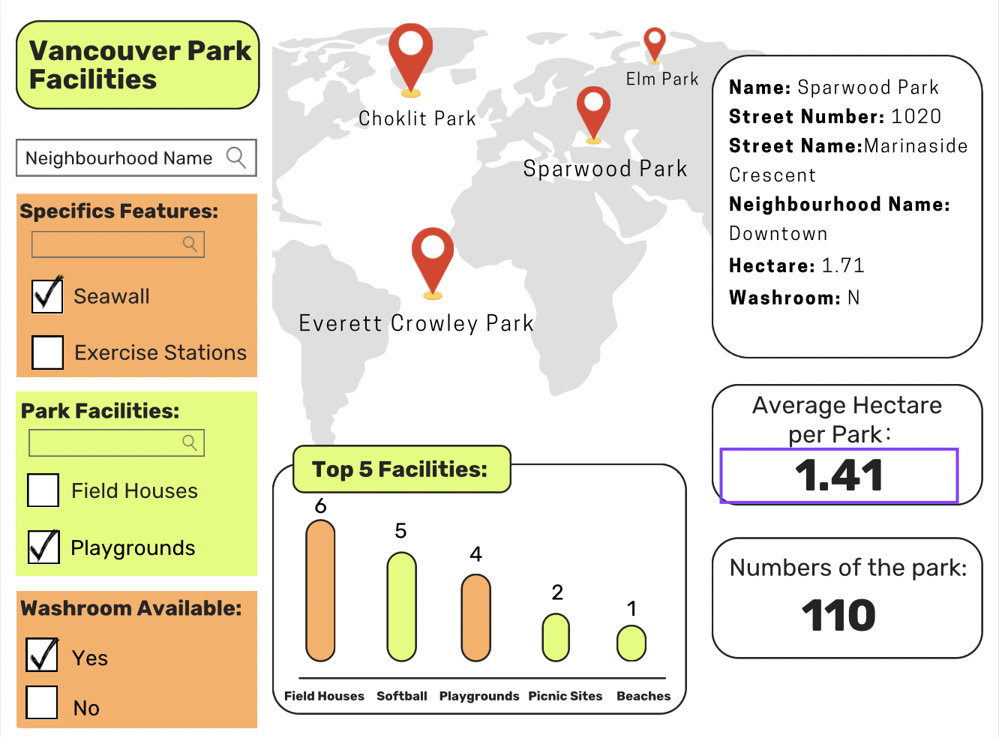

# Section 1: Motivation and Purpose

**Our role:** Data Scientist Consultancy Firm

**Target audience**: Vancouver park enthusiasts

For park enthusiasts or even those seeking a space for recreation, finding the right park nearby that is tailored to their specific needs could take multiple visits to different locations. This trial and error process can be very time consuming. If we were able to reduce the effort that it takes for one to find their perfect park, not only would we increase people’s willingness to explore these locations, we increase the overall health of Vancouverites as well as build stronger localized communities. Our application is intended to show the location of each park in their respective neighborhoods. Users of the dashboard will also be able to filter based on specific features such as the size of park, if the park has washrooms, and if the park has any facilities. The dashboard would also provide a summary at a glance on the total number of parks in the selected area, as well the total land area occupied by parks. Ideally, users would be able to interact with the dashboard to find specific facilities or features of a park, or find all parks in a specific neighbourhood.

# Section 2: Description of the Data

The main dataset to be used is the Parks dataset from Vancouver OpenData. We will be visualizing a dataset of approximately 216 parks in Vancouver. Each park has 15 associated variables that describe the following characteristics, which we hypothesize could be helpful in understanding the accessibility offered by each park: 

- **Park demographics** (`ParkID`, `Name`, `NeighbourhoodName`, `NeighbourhoodURL`)  
- **Park features** (`Official`, `SpecialFeatures`, `Facilities`, `Washrooms`, `Advisories`)  
- **Location information** (`StreetNumber`, `StreetName`, `EWStreet`, `NSStreet`, `GoogleMapDest`)  
- **Park size** (`Hectare`)

The location information is intended to be used to populate the main map on the dashboard with pins for each park. We will also complement this data with two additional datasets: Parks Facilities and Parks Special Features. The main purpose of these is to connect facilities to specific parks, and allow users to filter per facility on the dashboard. These map to the original dataset via the ParkID. The variables in each additional dataset are:

- **Parks Facilities**  
  - **Park Identity** (`ParkID`, `Name`)  
  - **Facility** (`FacilityType`, `FacilityCount`, `FacilityURL`)  
- **Parks Special Features**  
  - **Park Identity** (`ParkID`, `Name`)  
  - **Feature** (`SpecialFeature`)

# Section 3: Research questions and usage scenarios

**Persona**: Sarah Thompson – The Weekend Explorer

**Background:**  
Sarah Thompson is a 35-year-old marketing professional who recently moved to Vancouver. She enjoys spending her weekends outdoors with her dog but is still unfamiliar with the city's parks. She loves running, reading in quiet green spaces, and socializing with people in nature. Since she works full-time, she values efficiency and wants to find parks that suit her interests without wasting time visiting places that don’t meet her needs.

**Goals & Challenges:**

Goal: Find parks that match her interests—running trails, peaceful areas for reading, and social dog spaces.  
Challenge: She doesn't want to waste time visiting multiple parks only to realize they lack key features like washrooms, picnic tables, or trails.

**User Story:**  
Sarah is looking for a park where she can go for a morning run and then relax with her dog. She also prefers parks with washrooms and benches.

When Sarah opens our "VanParks Finder" app, she can enter her location and filter parks based on features like off leash dog areas, washrooms, and jogging trails. She notices that Stanley Park and Queen Elizabeth Park match her criteria, but Stanley Park is further away. She selects Queen Elizabeth Park and sees a summary of its features, including washrooms and available facilities.

Based on this, Sarah decides to visit Queen Elizabeth Park for her weekend outing. She shares the park’s details with a friend through the application, planning to meet there for a post-run coffee at a nearby café.

By using our app, Sarah saves time, discovers a new park, and enhances her outdoor experience with minimal effort. 

# Section 4: App sketch & brief description

The dashboard contains a central map display that shows the location of Vancouver parks using  location pins. A barchart titled “Top 5 Facilities” shows the distribution of the count of the top 5 park facilities in the map’s displayed area above. From the left filters, there is a search bar that allows users to filter parks based on their neighbourhood location. Below that is a specific features selection panel where the user can search for and filter parks based on specific features like “Seawall” or “Exercise Stations” etc. There is another selection panel where users can filter parks with specific facilities.  Another checkbox group below lets users filter parks based on washroom availability, with options for "Yes" and "No." On the right hand side, there is a park information slide box that provides specific details including name, location, size and facilities of the selected park. Users can easily get access to the detailed information of the preferred park by clicking on the pin of the park. Below the box, there are two key metrics displayed, indicating the average park size and the total number of parks within the map's displayed area.
